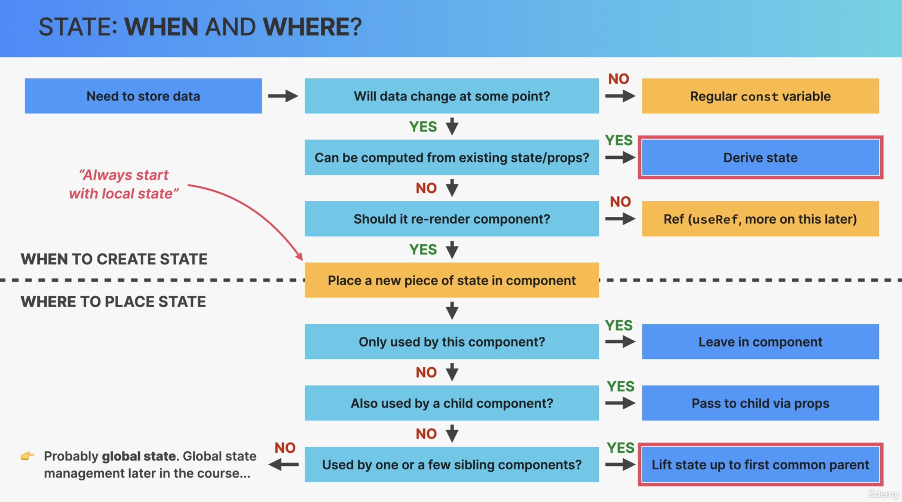

# Thinking in React

## React Mindset

- Thinking about components, state, data flow, effects, etc.
- Thinking in state transition, not element mutations

### Process

1. Break the desired UI into components and establish a component tree
2. Build a static version in React (without state)
3. Think about state:
   - When to use state
   - Types of state: local global
   - Where to place each piece of state
4. Establish data flow:
   - One-way data flow:
   - Child-to-parent communication
   - Accessing global state

## State management

1. Local State
   - State needed only by one or few components
   - State that is defined in a component and only that component and child components have access to it (by passing via props)
2. Global State
   - State that many components might need
   - Shared state that is accessible to every component in the entire application

## When and Where

